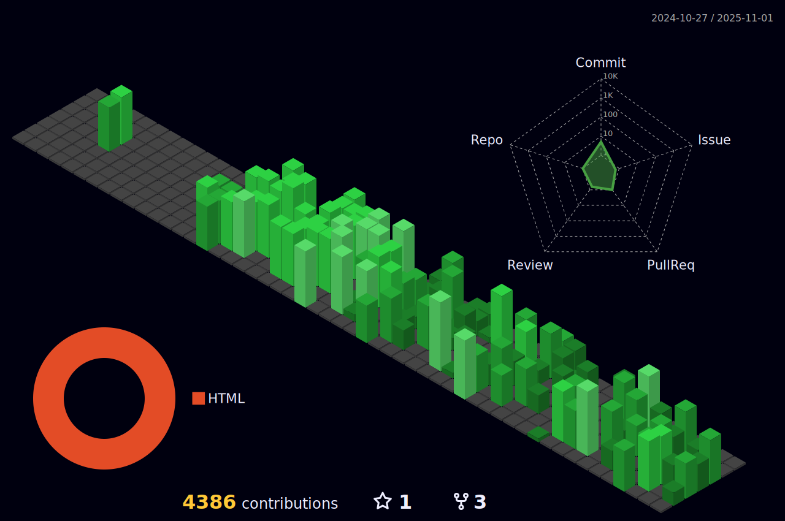

<!-- Header Section -->
<h1 align="center">
  Hi there, I'm Muzummil! 
  
</h1>

<!-- Social Icons (using flex for side-by-side layout) -->

  
  

<!-- Extra Section: About Me -->

  <h2 align="center">👨‍💻 About Me</h2>
  

    I am a full-stack developer passionate about building beautiful, dynamic applications.
    With expertise in JavaScript, TypeScript, Angular, React, Vue, and various back-end technologies,
    I love tackling challenging projects and continuously learning new skills.
  

<!-- Professional Skills Section -->

  
  
  
  
  
  

<!-- Technologies Section -->
## ⚡ Technologies

  
  
  
  
  
  
  
  
  
  
  
  
  
  
  
  
  
  

  
 

<!-- GitHub Stats Section (flex container for better layout) -->

  
  
  

  <!-- 
  
   -->

<!-- 3D Contribution Graph -->

  

<!-- Recent Activity Graph -->

  

<!-- Extra Section: Contact Me -->

  <h2 align="center">📫 Contact Me</h2>
  

    Feel free to reach out via <a href="mailto:muzummil.iqbal@gmail.com">Email</a> or connect with me on 
    <a href="https://www.linkedin.com/in/muzummil-iqbal-67b92515b/">LinkedIn</a>.
  

